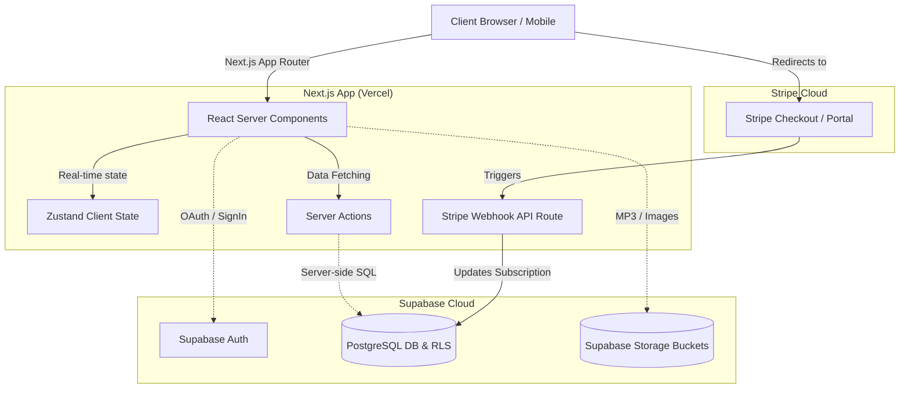

<div align="center">
  
  <h1>VibeTribe</h1>
  <p>A Full-Stack, Next-Generation Music Streaming Platform</p>

  <p>
    
    
    
    
    
  </p>
</div>

<br />

VibeTribe is a feature-rich, full-stack music streaming web application heavily inspired by modern streaming giants. It allows users to listen to music, create custom playlists, upload their own MP3 files, search for tracks, and even subscribe to premium tiers via Stripe—all managed securely through Supabase Authentication, PostgreSQL, and Next.js 14/15+ App Router.

---

## ✨ Features (A to Z)

- **Admin Capabilities**: Admins can oversee the platform and delete infringing or unwanted songs dynamically.
- **AI-Powered Prompts**: Simulated AI DJ/Assistant modal interface allowing users to prompt "AI" for vibe-based suggestions.
- **Authentication**: Email/Password login, as well as GitHub and Google OAuth integration, powered securely by Supabase Auth.
- **Custom Playlists**: Create, rename, delete, and curate entirely custom playlists. Add tracks on-the-fly and customize cover art.
- **Favorites / Liked Songs**: Like songs to instantly add them to your private library.
- **Full Media Player**: A sleek, persistent music player supporting Play, Pause, Next, Previous, Volume Control, and Seeking, powered by `use-sound` and Zustand global state.
- **Landing Page**: A stunning, high-converting unauthenticated landing page with hero mockups and CTAs.
- **Responsive Design**: Flawless UI/UX across Mobile, Tablet, and Desktop displays using Tailwind CSS.
- **Route Protection**: Advanced Next.js Layout routing isolating public pages from the protected dashboard `(main)` group.
- **Search Functionality**: Server-side debounced search matching song titles and authors.
- **Stripe Subscriptions**: Seamlessly subscribe to premium tiers using Stripe Checkout, managed dynamically via Stripe Webhooks.
- **Upload Tracks**: Users can upload custom MP3 files and cover art directly to Supabase Storage.
- **User Profiles**: Beautiful user account settings pages featuring avatars, names, emails, and active subscription status with direct links to the Stripe Customer Portal.

---

## 🏗️ Architecture

VibeTribe is built on a modern Serverless Architecture. It relies on the Next.js App Router for server-rendered UI and SEO, while offloading database queries, Row Level Security (RLS), and authentication to Supabase. Stripe handles the heavy lifting of billing and webhooks.



### Database Schema (Supabase PostgreSQL)

VibeTribe utilizes the following relational structure:
1. `users`: Stores user metadata and Stripe customer mapping.
2. `songs`: Stores track metadata (title, author) and references paths in the `songs` and `images` Storage buckets.
3. `liked_songs`: A join table mapping users to their liked tracks.
4. `playlists`: Custom user playlists, heavily protected by RLS.
5. `playlist_songs`: A join table linking songs to specific playlists.
6. `products` & `prices`: Synced dynamically from Stripe Webhooks.
7. `subscriptions`: Tracks the active premium tier of the user.

---

## 🛠️ Tech Stack

* **Framework:** [Next.js](https://nextjs.org/) (App Router, Server Components, Server Actions)
* **Language:** [TypeScript](https://www.typescriptlang.org/)
* **Styling:** [Tailwind CSS](https://tailwindcss.com/)
* **Icons:** [React Icons](https://react-icons.github.io/react-icons/)
* **State Management:** [Zustand](https://github.com/pmndrs/zustand)
* **Database & Auth:** [Supabase](https://supabase.com/) (PostgreSQL, GoTrue, Storage)
* **Payments:** [Stripe](https://stripe.com/)
* **Forms & Validation:** [React Hook Form](https://react-hook-form.com/) & [Hot Toast](https://react-hot-toast.com/)

---

## 🚀 Getting Started

Follow these steps to set up the project locally.

### Prerequisites

- Node.js (v18 or higher)
- npm or yarn
- A [Supabase](https://supabase.com/) account and project
- A [Stripe](https://stripe.com/) account
- A [GitHub](https://github.com/) account (for OAuth)

### 1. Clone the repository

```bash
git clone https://github.com/Faham-from-nowhere/VibeTribe.git
cd VibeTribe
```

### 2. Install dependencies

```bash
npm install
```

### 3. Setup Environment Variables

Create a `.env.local` file in the root directory and populate it with the following:

```env
# NextJS / App
NEXT_PUBLIC_SITE_URL=http://localhost:3000

# Supabase
NEXT_PUBLIC_SUPABASE_URL=your_supabase_url
NEXT_PUBLIC_SUPABASE_ANON_KEY=your_supabase_anon_key
SUPABASE_SERVICE_ROLE_KEY=your_supabase_service_role_key

# Stripe
STRIPE_SECRET_KEY=your_stripe_secret_key
NEXT_PUBLIC_STRIPE_PUBLISHABLE_KEY=your_stripe_publishable_key
STRIPE_WEBHOOK_SECRET=your_stripe_webhook_secret
```

### 4. Configure Supabase

1. Connect your Supabase project to the repository.
2. Execute the provided SQL queries (from `playlists.sql` and the standard Stripe schema) in the **SQL Editor** to generate your tables.
3. Set up **Authentication Providers** in Supabase (Email, Google, GitHub).
4. Create two public Storage Buckets: `images` and `songs`.

### 5. Start the Development Server

```bash
npm run dev --webpack
```
Open [http://localhost:3000](http://localhost:3000) with your browser to see the result.

---

## 🌐 Deployment

This application is fully optimized for deployment on **Vercel**. 

1. Push your code to a GitHub repository.
2. Import the project into Vercel.
3. Configure all Environment Variables in the Vercel dashboard.
4. Deploy!

*Note: Ensure you update your `NEXT_PUBLIC_SITE_URL` in both Vercel and your Stripe Webhook endpoints to match your live production URL.*

---

## 🤝 Contributing

Contributions, issues, and feature requests are highly welcome! Feel free to check the [issues page](https://github.com/Faham-from-nowhere/VibeTribe/issues).

## 📄 License

This project is open-source and free to use.
